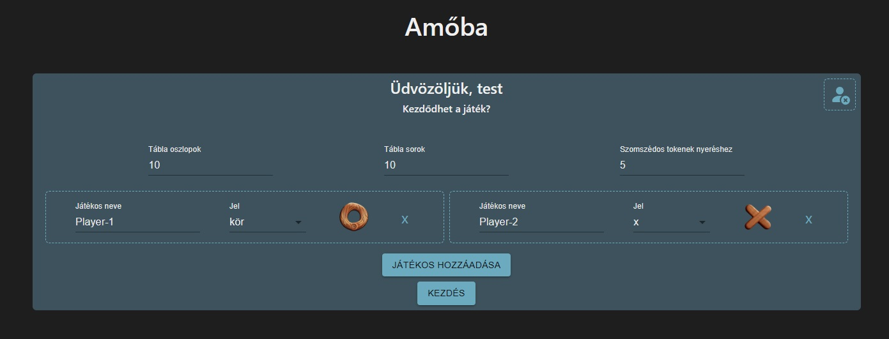

# ReadMe - Tic-Tac-Toe
Ez egy React alkalmazás, amely tartalmaz lokális demó autentikációt és egy amőba játékot.

## Tartalom

- [ReadMe - Tic-Tac-Toe](#readme---tic-tac-toe)
  - [Tartalom](#tartalom)
  - [Telepítés](#telepítés)
  - [Áttekintés](#áttekintés)
    - [Bejelentkezés](#bejelentkezés)
    - [Amőba](#amőba)
  - [Technológiai Stack](#technológiai-stack)
  - [Projekt Struktúra](#projekt-struktúra)
  - [Bejelentkezés](#bejelentkezés-1)
  - [Amőba](#amőba-1)

---

## Telepítés
Az alkalmazáshoz szükség van az `npm` modulra, amely innen telepíthető: [NodeJs](https://nodejs.org/en)

Első lépés az alkalmazás telepítése ezzel a paranccsal:
```
$ npm install
```

Utána, az alkalmazás átfordítása:
```
$ npm run build
```

Miután az alkalmazás át lett fordítva, ezzel a paranccsal indítható:
```
$ npm start
```

Ha mindezzel megvagyunk, az alkalmazás elérhető itt: http://localhost:8082/

---

## Áttekintés

### Bejelentkezés

A böngésző megnyitása után navigáljunk a következő címre: http://localhost:8082/ . Ezek után erre az oldalra érkezünk:


Az oldal nyelvét megváltoztathatjuk a jobb felső sarokban lévő legördülő menüvel.

A játék elkezdéséhez be kell jelentkeznünk. Ehhez használhatunk egy teszt felhasználót, vagy regisztrálhatunk egy saját fiókot.

Elsőnek nézzük meg hogy hogyan történik a regisztráció. Magyar nyelvbeállítás mellett ehhez kattintsunk a "Regisztrálj" linkre.

Miután ezzel megvagyunk, egy ilyen űrlap jelenik meg:


Egy tetszőleges felhasználónév, email és jelszó megadása után kattintsunk a regisztrálás gombra.

Ha sikeres volt, az oldal automatikusan átirányít a bejelentkezés oldalra:


Regisztrálás nélkül egy teszt felhasználóval be tudunk jelentkezni:

* felhasználónév: `test`
* jelszó: `test1234`

Ha a bejelentkezés sikeresen megtörtént, az oldal átirányít a játék beállítása oldalra.

### Amőba

Miután bejelentkeztünk, a főoldalon lehetőség van a játék beállítására:



Itt lehetőségünk van:

* kijelentkezni
* megadni a tábla méreteit
* megadni az egymás melletti jelek számát a játék megnyeréséhez
* új játékos hozzáadására
* a játékosok nevének és jelének megadására

A beállítások után a játék a `Kezdés` gombra kattintva indítható.


## Technológiai Stack

Az alkalmazás a következő technológiákat is használja:

- `TypeScript`: TypeScript lehetővé teszi típusok pontos nyomon követését, és ezek ellenőrzését fordításkor. Ennek segítségével a projekt átláthatóbb lehet a típusok strukturált tárolásával, karbantarthatóbb lesz a kód és a hibák hamarabb felismerhetőbbé válnak.
- `React`: React egy kliens oldali framework, amely lehetővé teszi újra használható UI elemek fejlesztését. A Virtuális DOM segítségével React csak a módosult UI elemeket rendereli újra, ezzel gyorsabbá téve az oldalt.
- `React-Router`: Lehetővé tesz a kliens oldali navigálást, és gyorsabb oldal váltást. Továbbá számos más lehetőséget nyújt az oldalak betöltésének optimalizálására.
- `React-Redux`: Lehetővé teszi az alkalmazás változóinak központi tárolását egy központi és átlátható módon.
- `Webpack`: Webpack segítségével van a projekt felépítve. A TypeScript kód fordítását elvégzi, importálja a függőségeket, legenerálja a html oldalt és átmásol néhány fájlt.
- `Bootstrap`: Hasznos UI elemeket és CSS szelektorokat biztosít, amely nagyban segíti a reszponzív oldalak fejlesztését is.
- `React MUI (Material-UI)`: A Google által népszerűsített Material Design UI elemeket tartalmaz React környezetbe fejlesztve.
- `Formik`: Megoldást nyújt az űrlapokkal kapcsolatos gyakori feladatok optimalizált megoldására, mint: validálás, változók kezelése és elküldés.
- `Yup`: Egy könyvtár változók validálására. A segítségével megadható hogy egyes változók milyen elvárásoknak kell hogy megfeleljenek.

TypeScript sokat segít a típusokból eredő hibák korai felismerésében, valamint a típusok rendszerezett tárolásával áttekinthetőbbé teszi a projektet.

React és Redux egy jól rendszerezett framework-öt nyújt összetett alkalmazás fejlesztésére. React segítségével újra használható és jól elhatárolt UI elemek fejleszthetőek. React Redux segíti, hogy az alkalmazás működési logikája jól elkülönülő módon legyen kezelve. Ennek eredménye, hogy az egyes elemeknek jól behatárolt feladatkörei vannak.

Webpack elengedhetetlen az projekt felépítéséhez, valamint a sok beállítható paraméter és beépülő modul segítségével a project egyedivé tehető és optimalizálható.

Bootstrap hasznos szelektorokat nyújt reszponzív alkalmazások fejlesztésére, míg React MUI testre szabható és sok funkcióval rendelkező UI elemeket ad.

Formik és Yup egy jól átlátható keretet ad űrlapok készítésére.

## Projekt Struktúra

A projekt forrás fájlok a fő könyvtárban egy `src` nevű mappában találhatóak. Itt négy mappát találhatunk:

- `global` mappában vannak tárolva a fájlok, amelyek a projekt egészéhez kapcsolódnak. Ilyen például a Redux store konfigurálása vagy a fő CSS és MUI témák megadása.
- `pages` mappában találhatóak az alkalmazás oldalak felépítéséhez szükséges fájlok. A navigációs feladatokat `React Router` látja el, amely a `src/pages/Router.tsx` fájlban van konfigurálva. Ebből a fájlból az alkalmazás minden más pontja elérhető, és ideális kiindulópont annak feltérképezésére.
- `features` további mappákat tartalmaz, ahol az alkalmazás egyes részei funkció alapján vannak csoportosítva. Ebben a mapppában a következő további mappák és funkciók találhatók:
  - `auth`: A felhasználók regisztrálásával, bejelntkezésével és felhasználói beállításokkal kapcsolatos funkciók.
  - `localization`: Nyelvi bállításokkal kapcsolatos funkcionalitások.
  - `navigation`: Olyan UI elemeket tartalmaz, amelyek fő feladata a navigáció. Ilyen például a header és a footer bár.
  - `server`: Egy egyszerű **content server**, amely elérhetővé teszi az alkalmazás fájlait a böngészőben.
  - `tictactoe`: Az amőba játékkal kapcsolatos UI elemek és fájlok találhatóak itt.

## Bejelentkezés

Az autentikációval kapcsolatos fájlok itt találhatóak: `src/features/auth`

Ha elnavigálunk a `src/features/auth/components/container/LoginForm.tsx` fájlba, látjuk hogy az űrlap állapot változóit Formik kezeli, és a Yup module segítségével vannak a megadott adatok ellenőrizve.

Amikor a felhasználó elküldi az űrlapot, ez a kódrész lesz meghívva:

``` ts
onSubmit={(values, action) => {  
    // Once the user submits the form, validate the values with this function
    validateLogin(values)
    .then(() => {
        // Update locally the logged username
        dispatch(setLoggedUser(values.username));
        // Let React Router take over. Ideally, would send the data to the server for authentication
        submit(values, { method: 'POST' });
    })
    .catch((err) => {
        // If there was an error, display the error in the appropriate input field
        if (err instanceof UsernameNotFoundError) action.setFieldError('username', err.message);
        else if (err instanceof IncorrectPasswordError) action.setFieldError('password', err.message);
        else action.setFieldError('username', error.unkownError);
    });
}}
```

Az első lépés egy `validateLogin` nevű aszinkron funkció meghívása, amely ezen az útvonalon érhető el: `src/features/auth/util/validateLogin.ts`

``` ts
export default async function validateLogin(userData: UserData) {

    // Get the registered users from local storage
    const registeredUsers = getRegisteredUsers();

    // Throw an error, indicating that there is no account with the given username
    if (!registeredUsers[userData.username]) throw new UsernameNotFoundError();
    
    // Check if the stored hashed password matches with the given password
    const isPasswordCorrect = await bcryptjs.compare( userData.password, registeredUsers[userData.username].password );

    // Throw an error, indicating that the password is incorrect
    if (!isPasswordCorrect) throw new IncorrectPasswordError();

    return isPasswordCorrect;    
}
```

Itt látható, hogy a felhasználó bejelentkezésnek első lépése a regisztrált felhasználók listájának beolvasása a **local storage**-ból. Ha van a megadott felhasználónévvel egyező felhasználó a listában, akkor ellenőrizzük a jelszót. A jelszavak hash-elve vannak tárolva, így `bcrypt.compare` metódus segítségével elsőnek hasheljük a megadott jelszót, majd összehasonlítjuk a listában tároltal.

Ha a folyamat során valami okból meghiúsul a felhasználó autentikációja, a funkció hibát dob.

Ha a felhasználó sikeresen autentikálva lett, a `LoginForm.tsx` fájlban a következő lépés a felhasználó nevének rögzítése a Redux Store-ban, és tovább adni a végrehajtást **React Router**-nek. Jelenleg csak átirányítja a felhasználót a főoldalra.

## Amőba

Az amőba játékkal kapcsolatos fájlok itt érhetőek el: `src/features/tictactoe`

A játék menete során, ahogy a játékosok jeleket helyeznek el a táblán, a **Redux Store**-ban rögzítjük a lerakott jel helyét és a formáját. Ebben a formában vanna tárolva az elhelyezett jelek:

``` ts
export default interface PlacedToken {
    type: TokenType;
    position: Coordinate;
}
```

A játékhoz kapcsolódó **Canvas** elem ebben a fájlban van létrehozva: `src/features/tictactoe/components/container/GameCanvas.tsx`

Itt azt láthatjuk, hogy a játék táblájára való kattintáskor ez a függvény van meghívva: `src/features/tictactoe/redux/reducers/thunks/placeCurrentPlayerTokenThunk.ts`

A függvény elsőnek megvizsgálja hogy a kiválasztott cella már tartalmaz-e jelet. Ha nem, akkor hozzáadja a **Redux Store**-ban tárolt listához.

Amikor a lista módosul, a játék tábla automatikusan újra van renderelve:

``` ts
// This hook is responsible for drawing elements onto the canvas
useEffect(() => {
    if (!canvasRef.current || !mapAssets) return;

    const canvas = canvasRef.current;
    const ctx = canvas.getContext('2d');

    // If we coudn't retrieve the canvas context, there's nothing to do
    if (!ctx) return;        

    // Retrieve the board dimensions and the token positions
    const { cellSize } = state.gameResources.boardDimensions;
    const { boardRows, boardColumns } = state.gameInput;
    const { tokens } = state.gameState.inGameResource;
    const { boardDimensions } = state.gameResources;

    // Clear the previous canvas
    ctx.clearRect(0, 0, boardDimensions.canvasWidht, boardDimensions.canvasHeight);

    // Draw a cell border inside each cell
    for (let columnIndex = 0; columnIndex < boardColumns; columnIndex++) {
        for (let rowIndex = 0; rowIndex < boardRows; rowIndex++) {

            const canvasX = columnIndex * cellSize;
            const canvasY = rowIndex * cellSize;

            ctx.drawImage(mapAssets.fullCellFrame.image, canvasX, canvasY, cellSize, cellSize);
        }
    }

    // Draw each token placed on the canvas
    tokens.forEach(token => {
        switch (token.type) {
            case 'bipyramid': ctx.drawImage(mapAssets.bipyramid.image, token.position.x * cellSize, token.position.y * cellSize, cellSize, cellSize);
            break;
            case 'triangle': ctx.drawImage(mapAssets.triangle.image, token.position.x * cellSize, token.position.y * cellSize, cellSize, cellSize);
            break;
          // Other token types...
        }
        
  });
}, [mapAssets, canvasRef.current, state.gameState.isInitialized, state.gameResources.boardDimensions, state.gameState.inGameResource.tokens]);
```

Ha a szükséges canvas context a rendelkezésünkre áll, az első, hogy a cellák kereteit a táblára rajzoljuk. Ha ez megtörtént, a következő lépés a táblára korábban elhelyezett tokenek rajzolása.